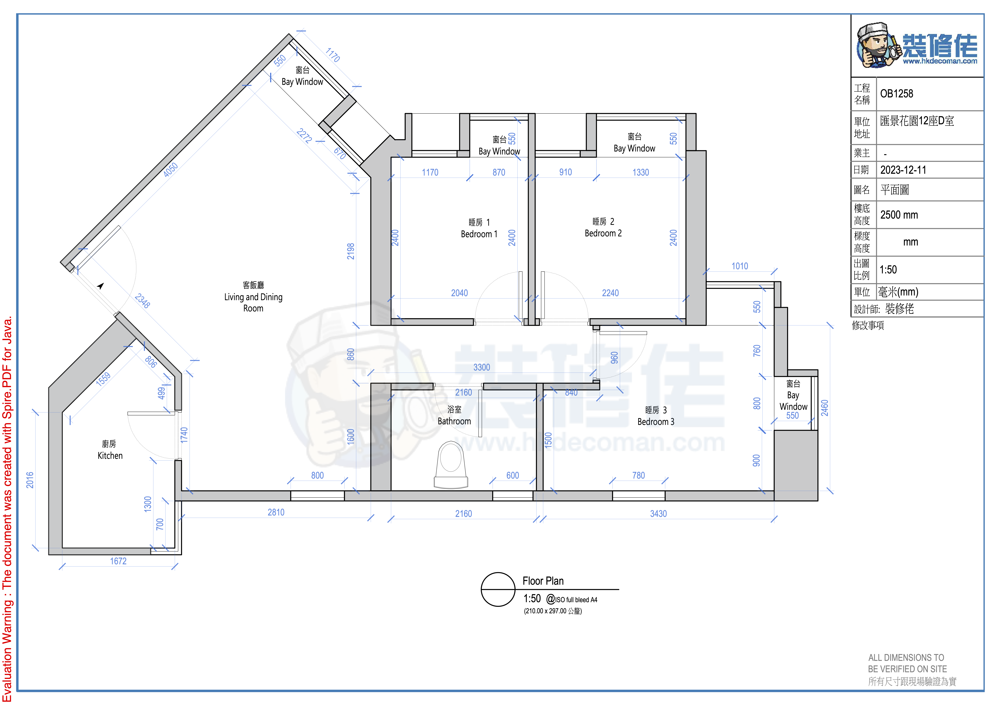
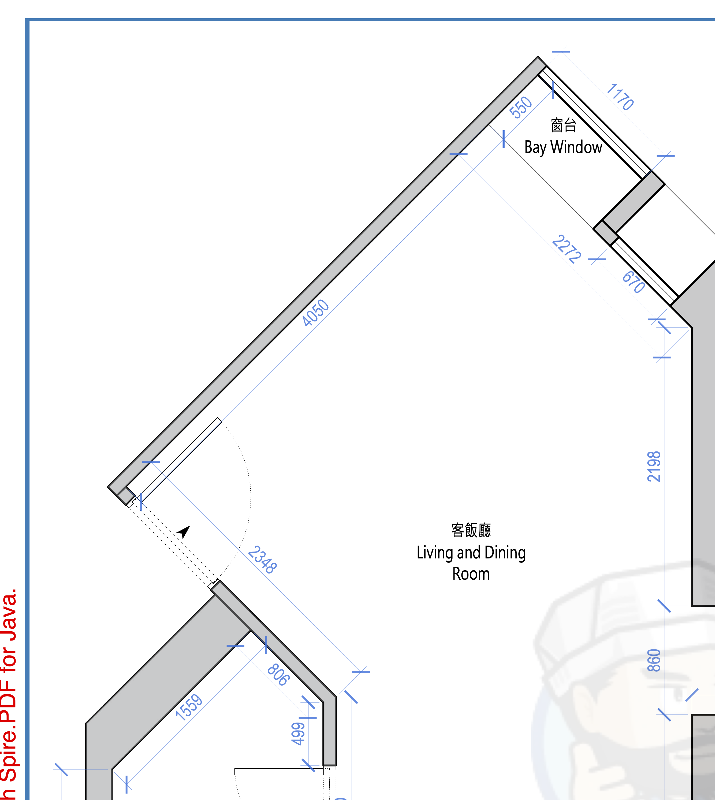
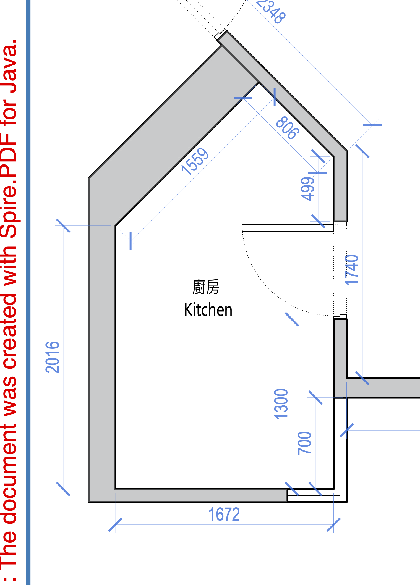
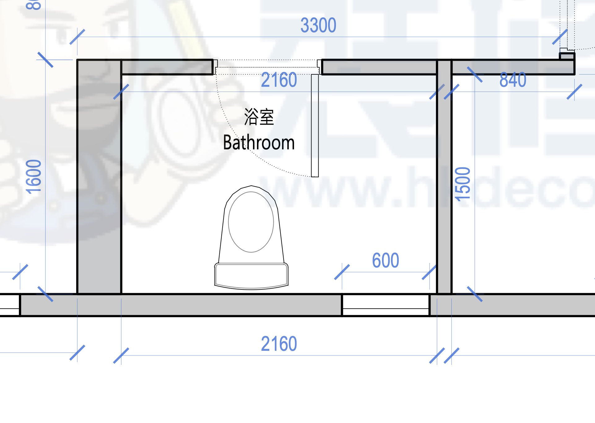
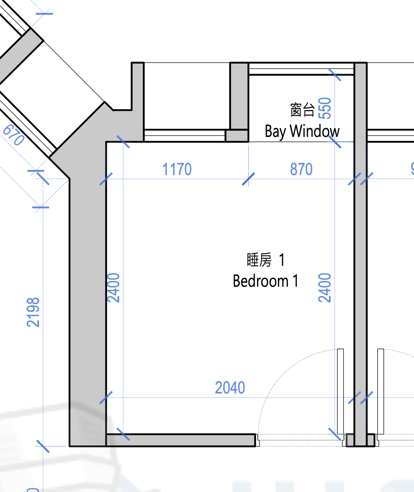
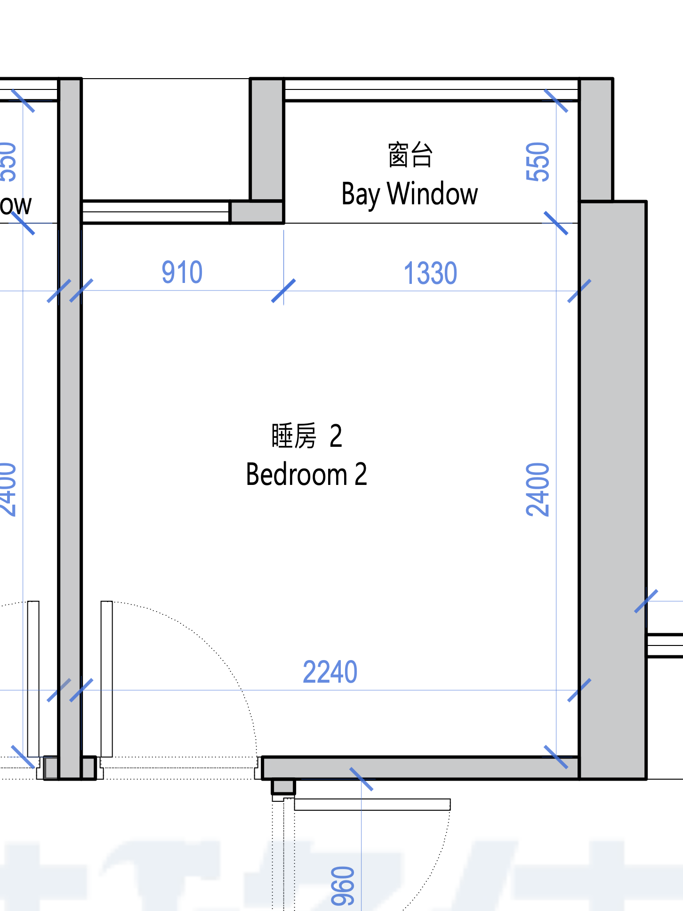
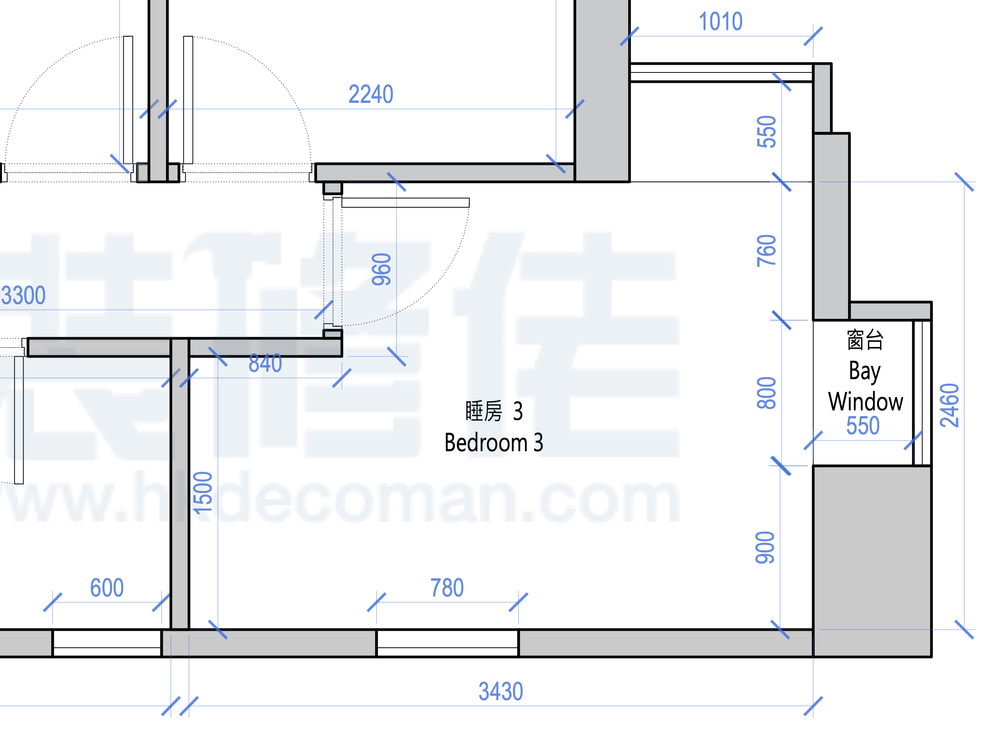

# Floor Plan Project

## Complete Home Layout

### Original Floor Plan


## Room-by-Room Breakdown

### 1. Living Room


**Description:**
[Add your description of the living room layout here]

### 2. Kitchen


**Description:**
[Add your description of the kitchen layout here]

### 3. Dining Room


**Description:**
[Add your description of the dining room layout here]

### 4. Bathroom


**Description:**
[Add your description of the bathroom layout here]

### 5. Small Bedroom


**Description:**
[Add your description of the small bedroom layout here]

### 6. Medium Bedroom


**Description:**
[Add your description of the medium bedroom layout here]

### 7. Large Bedroom


**Description:**
[Add your description of the large bedroom layout here]

## Project Notes

- **Total Rooms:** 7 individual floor plans plus original complete layout
- **File Format:** PNG images
- **Status:** [In Progress / Complete / Under Review]

## Usage

1. View the original complete floor plan for overall layout
2. Reference individual room plans for detailed layouts
3. Use for renovation planning, furniture placement, or design discussions

## Files Structure

```
floor-plan/
├── README.md
├── floor-plan-original.png
├── floor-plan-1-living-room.png
├── floor-plan-2-kitchen.png
├── floor-plan-3-dining-room.png
├── floor-plan-4-bath-room.png
├── floor-plan-5-bedroom-small.png
├── floor-plan-6-bedroom-midean.png
└── floor-plan-7-bedroom-big.png
```