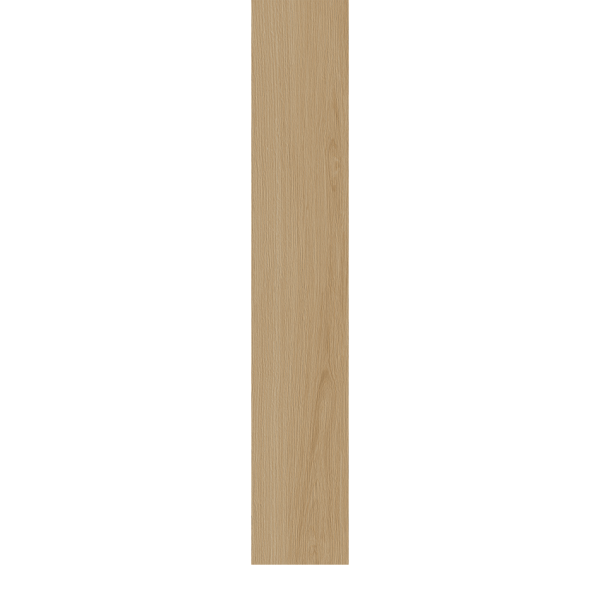
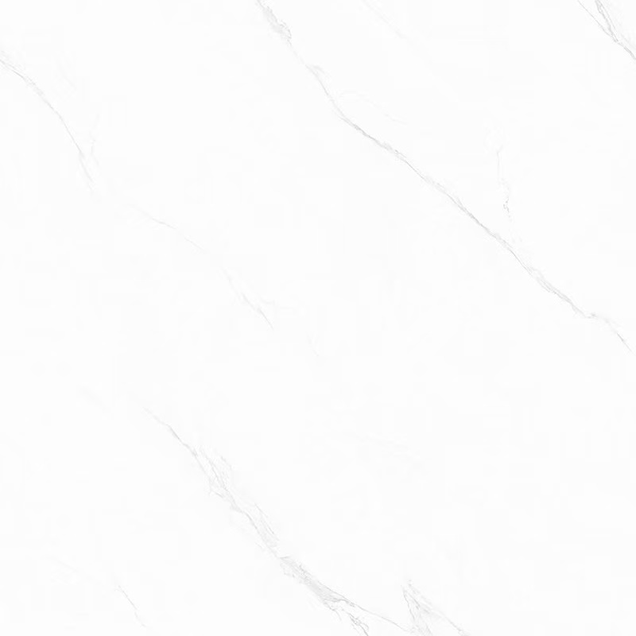
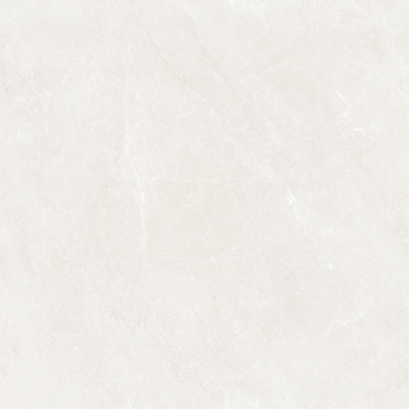
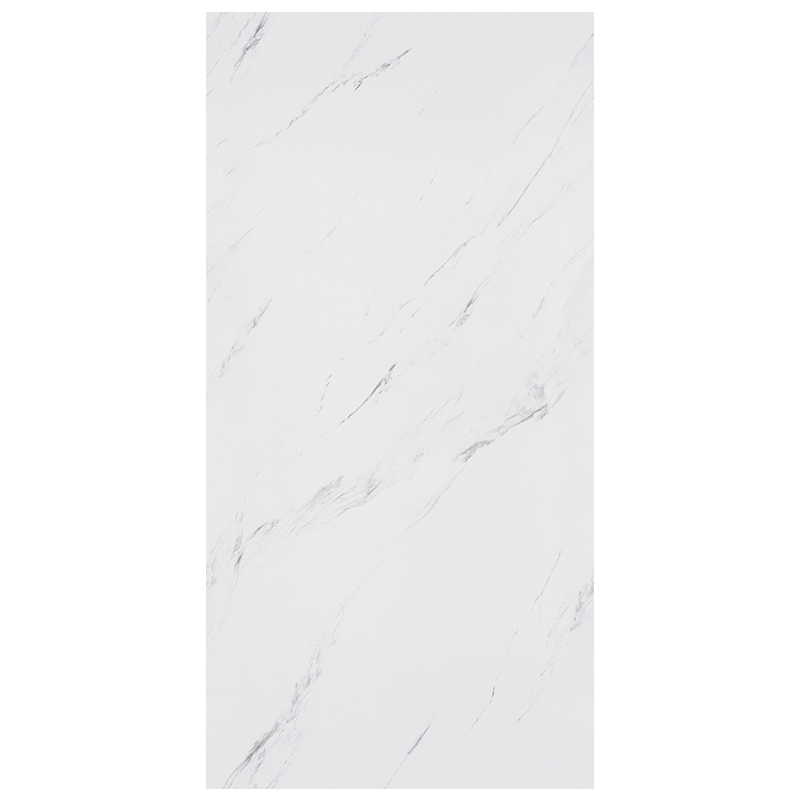
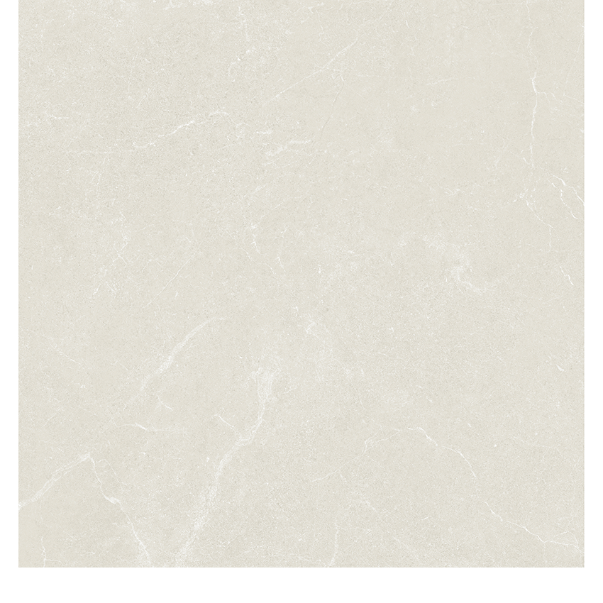

# 平面圖

# 一、 準備工作
## 1.1 煤氣關閉，不改動
## 1.2 預留網線和電視線

# 二、拆除
## 2.1 拆天花、假天花、牆地板
整间的白石灰要全部打掉
## 2.2 換窗 （確認是否需要）

# 三、水
## 3.1 廚房
洗菜池的高度為 850 供參考 入水和去水
## 3.2 洗手間
俯視圖
| |  |   |
|---|---|---|
| 牆 |  浴室門 | 牆  |
| 洗衣機 |  | 淋浴間  |
|  |   |  淋浴間 |
| 洗手盆 | 馬桶 / 熱水爐 | 淋浴間 |
|  |   | 窗 |

# 四、電
## 4.1 電箱更換

## 4.2 燈、排氣扇、冷氣機的位置

## 

開關

插蘇
燈

射燈

电改造

预埋管線

# 五、泥瓦

防水

贴瓷砖
踢腳線

還要準備 雲石

# 五、 假天花

廚房 衛生間

不可以高過2400 爭取2300

# 六、 冷氣機

參考下 冷氣機的

飯廳 1 個 分體式
主人房 1 個 分體式
中臥室 1 個 窗台式
小臥室 1 個 窗台式

# 七、木

櫥櫃

衣櫃 餐邊櫃

木門

木工（吊顶、橱柜、隔断、门框等木质结构）
换冷气机（建议在木工或油漆阶段，尤其是如果涉及到空调安装位置的改动，最好在墙面粉刷和木工完工后进行，避免后续施工影响安装）
油漆与涂料

# 重要备注

the design refers to this

https://wingshing-indesign.com/work/blog-rush

 走廊的門頂端
铰链要304
要海棠角

老板牌抽油烟机

排扇 

# 設計軟件 Sweet Home 3Dßß
https://www.sweethome3d.com/freeModels.jsp

# 匯景花園 功能點 櫃子 電器 家具

所有單位均為毫米，因為家電和家具尺寸不確定，或是有家具天生需要使用空間，會標出使用空間，或假設的最大空間。

默認順序是寬深高

順序。

任何空間先介紹大小，然後是門，，然後以順時針12點為起始，從低到高介紹每一處的細節，如果需要介紹高低，從低到高。

具體細節，先說參數，然後說品牌，最後解釋為什麼。

然後是水電煤。

牆身，地板，貼磚，和任何附加物最後介紹。
 

## 1. 小房間

## 2. 中房間

## 3. 大房間
 
                                                       

               (3230, -2550)          (4475, -2550)      (4775, -2550).   (5825, -2550) 空地面积为 1050 x 275

(2270, -1550)  (3230, -1550) 有40 x 100的墙突出来

(2270, 0)                                                              (5825, 0)

左上墙 100
下墙 125
右墙 150

## 4. 廁所

假天花 高度2.3 余 约 200 来

(0, -1550) (2170, -1550)

(0,0) (2170, 0)

左邊牆 300 上邊 100 右邊100 下邊 125

大小：2170 x 1500
門： 1門

### 4.1 淋浴間

[https://detail.tmall.com/item.htm?abbucket=18&id=980331832021&mi_id=0000Pc5gPOsMNsKeO1byUBGawN5nkTai2XreQIVwW3rYV18&ns=1&skuId=6102020575414&spm=a21n57.1.hoverItem.2&utparam=%7B%22aplus_abtest%22%3A%2205232a2e82b9001ca12ae35f0e132782%22%7D&xxc=taobaoSearch](https://detail.tmall.com/item.htm?abbucket=18&id=980331832021&mi_id=0000Pc5gPOsMNsKeO1byUBGawN5nkTai2XreQIVwW3rYV18&ns=1&skuId=6102020575414&spm=a21n57.1.hoverItem.2&utparam=%7B%22aplus_abtest%22%3A%2205232a2e82b9001ca12ae35f0e132782%22%7D&xxc=taobaoSearch)

https://detail.tmall.com/item.htm?abbucket=18&id=717894086874&mi_id=0000Q8mRcCYivp8_N-F-AKs2TZVXkZ9OgejtDd6TSa2TPZ8&ns=1&priceTId=2100c80717608787548333024e08f4&skuId=5006363464203&spm=a21n57.1.hoverItem.12&utparam=%7B%22aplus_abtest%22%3A%220b7d7583c5eeae30c63b5b9c45b2dd35%22%7D&xxc=taobaoSearch

1550 x 60 x 2000

大小： 850 x 1500
門： 趟門防水

地板高度為50，要做防水。

有個窗台， 長寬高未知？？？

花灑的位置未知 ？？？？

放換洗衣服的地方未知？？？？？

洗髮水沐浴露可以放在窗台，也可以放在宜家塑料三角架

1500 x 100 x2300的磨砂玻璃，用以分隔淋浴間和廁所。

### 4.2 馬桶

自由咀 马桶 實際使用區域為 700 x 710 还需要脚向前的空间

[TOTO CW631PJ 自由咀分體式座廁](https://www.builtinpro.hk/toto/cw631pj)
424 x 710 x 765, HKD 2989

[TOTO C945RE 自由咀分體座廁配油壓廁板](https://www.builtinpro.hk/toto/c945re)
396 x 695 x 789, HKD 3190

[rigel wc9246F-HKM](https://www.builtinpro.hk/rigel/wc9246f-hkm)
385 x 650 x 750, HKD 2689

注意 馬桶有最小坑距 305mm 或者 400 mm

### 4.3 電熱水爐 还是煤气

熱水爐位於馬桶上方， 暫定懸空高度1800 ？？ 水平位置？？？？ 暫定為偏向馬桶上方偏右。

[Berlin 柏林 25公升中央儲水式電熱水爐 (單相) UHP-6.5A](https://hkele.com.hk/UHP-6-5A-3KW-UW2R-)
325 x 285 x 670, HKD 2789

[Rasonic 樂信 RWH-CT21L-R 19公升](https://www.builtinpro.hk/storage-water-heater/rwh-ct21l-r?u=hot_item_5)

[美的玲珑UDmini电热水器 60L 695 x 316 x 555 三千三](https://detail.tmall.com/item.htm?ali_refid=a3_420434_1006%3A1151312967%3AH%3AFNluQBAv2OITf65biqoqio6SEpIY9vuj%3Aaf1b9837e6c8d4e02875c0a87e997652&ali_trackid=318_af1b9837e6c8d4e02875c0a87e997652&fpChannel=101&fpChannelSig=4a162cdc8b87c206fd35b539681cad89e8237895&id=867393983829&mi_id=0000uPbopwSNf_nAvxhB8EROuxEpwloHRPK3VtTxNE8cPBk&mm_sceneid=0_0_126241459_0&priceTId=2100c88e17600699343734320e0935&skuId=5713090645829&spm=a21n57.1.hoverItem.4&u_channel=bybtqdyh&umpChannel=bybtqdyh&utparam=%7B%22aplus_abtest%22%3A%22cb82f4b1aa7722bf011f6d1b8e478422%22%7D&xxc=ad_ztc)

买不了， 看一下顺丰集运可不可行。

如果用煤气炉 煤气管的位置是固定的 贴墙

### 4.4 波轮洗衣機

洗衣機佔用區域為 610 x 640 x 50。

有地台 抬高 它和洗手台 防止積水損壞洗衣機 ？？？ 

洗衣機左右上要預留15 散熱，

另

[小天鹅小乌梅2.0 550 x 580 x 980 二千一](https://detail.tmall.com/item.htm?id=837952938134&pisk=f4qDovXA0rufWPEBpamfk3XNpUbKHKisr5Kt6chNzblSX-ht6OxgQJ6jWRlTjcV7aVrxD-FkhuVHXnCflR-ivc5d9MILhxnsb6BY-U9kGvHw7Ghq_0onDrsV9MILhrckVQ5LXkKBz2DtbxoZ_QWoQAlZbq-ZaTDZBIlZg5yy-EJAsY-0vK0ntCANXG8ea_c33bxHduDPfXjIwhR44xAdL-coy4EonqcK7HmnkoP8QoEjPGKsf8U3sPPFwEh4-vVoJrfHmWVjQ7kzMOLsEP2aAmgDQho07SZilrv1d8o4NyGIua1SEoEKSXgkiHcTcSEo-k5yqYszZU8e3ntsUOEk5U3qFYcpOLK5TfNKzrWlEezIuYMb9lBk7EdBbhL5ETYUDqkShS1..&scene=taobao_shop&spm=a1z10.1-b-s.w15914280-23624881644.2.7643ae1d2RtNjd&skuId=5597699136170)

[美的MG10V36T 10kg金屬鈦 550 x 565 x 940 二千](https://detail.tmall.com/item.htm?ali_refid=a3_420434_1006%3A1687218187%3AH%3AJWf8IZp8ftIhYjEmhJglK9jxsJdk96b3%3A965b32664dd5c3d332847c36b8bff49b&ali_trackid=318_965b32664dd5c3d332847c36b8bff49b&id=822806092748&mi_id=0000uJ44YB-ig_j0AVqa3R2wC1BjWgp57nVoNKpmLCJ19W8&mm_sceneid=0_0_5439422246_0&priceTId=2100c89817600869731922771e0900&skuId=5901075604302&spm=a21n57.1.hoverItem.5&utparam=%7B%22aplus_abtest%22%3A%229b3181ba765d775060ed97db0aeb2f98%22%7D&xxc=ad_ztc)

左右後預留50，開蓋預留330

### 4.5 洗手台

面盆

[TOTO L710CSRE 半嵌入檯上盤](https://www.builtinpro.hk/l710csre)
500 x 450 x 850, HKD 2189

面盆櫃 柜子定制： 参考

[單門左側紙巾孔訂製櫃](https://housestyle.com.tw/product/toto-l710cgur-%E8%A8%82%E8%A3%BD%E6%B5%B4%E6%AB%83/)

我们要落地的， 侧边的 纸巾孔也可以， 颜色？？？？

洗手盆下面有收納櫃

#### 4.6 洗手台上方吊柜

吊柜定制 

500 x 200 x 600 离地高度为 1300 如果影响到假天花
三行两列
外面整个是镜面

毛巾放哪裡？？？？

## 5. 餐廳

組合櫃 高的 收納 乾貨 雜物

組合櫃 矮的 用來放 電飯鍋 或是烤箱 或是湯鍋 承擔一定擺放食物的任務。

要考慮深度 和對流窗 還有空調容易維修

1個餐桌 4個椅子

## 6. 廚房

### 6.1 灶台

石英石面板

一個煤氣 同時在櫃子下方預留一個 電線 給 電陶爐 

上方有抽油煙機

再上方有收納櫃

灶台高 750

### 6.2 洗菜池

單水池 大水池 能裝得下鍋

水池 高850， 高過 灶台

洗菜盆 500 x 420 x 220

### 6.3 冰箱

1959 6500
1446 7013

## 7. 客廳
                               (-1924, 6465)

(-4856, -3533)

             (-3150, -1827)

               (-3150, 0)

### 7.1 電視

### 7.2 電視櫃

不要玄关

但需要以下功能：鞋柜，摆雨伞，摆钥匙，手套，临时摆买完的菜

入门右手边的墙部分可以打掉  佔用原本廚房的空間

電箱的位置要改在外面 原本為廚房裡面 廚房門右側前方

尝试计算 1米559 = 洗衣机宽 + 冰箱宽 + 柜子深度

能否摆得下洗衣机加冰箱 加定制柜子

洗衣机常见阔度 0.6米 深度 0.5米
单门冰箱阔度0.55米 深度 0.623米 东芝

这样子 玄关的柜子还可以有 0.4米的深度

## 8. 店舖

### 8.1 天貓 

[TOTO官方旗艦店](https://toto.tmall.com/?spm=a1z10.3-b-s.1997427721.d4918089.1eb16d4fmPhipM)

[海尔官方旗舰店](https://haier.tmall.com/?spm=a220o.1000855.1997427721.d4918089.2f775e8fEwkUHn&from_branding=true&ali_trackid=41_f60a6b1ad3f480890d40e28130b1a2b8&mm_sceneid=0_0_18307420_0)

[松下](https://panasonicdq.tmall.com/shop/view_shop.htm?spm=a21n57.shop_search.0.0.3fe56a84AeDaFm)

[小天鵝](https://littleswan.tmall.com/?spm=a1z10.1-b-s.1997427721.d4918089.7643ae1d2RtNjd)

[LG](https://lg.tmall.com/?spm=a1z10.4-b-s.1997427721.d4918089.d1196e06UkqxCE)

[美的](https://midea.tmall.com/shop/view_shop.htm?spm=pc_detail.30350276.shop_block.dshopinfo.56897dd64NN662)

BBE

https://hkele.com.hk/info/On-Ying-Court-Sepcial-Offer

Built-In Pro

https://www.builtinpro.hk/rigel/wc9246f-hkm

Bath and kitchen

https://bathkitchen.hk/product-category/basin/

Germanpool

https://www.germanpool.com/chi/kitchen/

### 8.2 京東

# 插座

## 1. 小房間 共 3個 + 1

中間2個 下面一個

冷氣機 1 個 獨立

## 2. 中房間 共 2個 + 1

預留2個

冷氣機 1 個 獨立

## 3. 大房間 共 2 個 + 1

對面一個 書桌1個

冷氣機 1 個

## 4. 廁所 共4個

熱水器， 排氣，洗衣機，預留一個

## 5. 餐廳 共2個 + 1

微波爐，預留一個

冷氣機 1 個 獨立

## 6. 廚房 共7個

電磁爐，電飯鍋，雪櫃，抽油煙機，排氣，預留2個，

門或者開放式？？？

電磁爐

煤氣灶

邊角是水池和煤氣爐的交界 水池比較高

水池

冰箱

煤氣灶 水池 冰箱上都有櫥櫃拿來放東西

## 7. 客廳 共10個

電視櫃8個， 另一邊預留2個

總共30個，外加4個冷氣的 插座

# 燈

## 1. 小房間 共1個
## 2. 中房間 共1個
## 3. 大房間 共1個
## 4. 廁所 共1個
## 5. 餐廳 共1個
## 6. 廚房 共2個 射燈
## 7. 客廳 共1個

走廊 1 個燈 ， 在離三間房近的地方

一共9個燈

# 磚

厅、房 200 x 1200 = 43m 180片 x 33元 = 5940元
脚线   66  x 1200 = 49m 14条 x 33 元 = 462 元
    加工费 252 元

厨墙 800 x 800 = 19m 30片 x 68元 = 2040元

厨地 800 x 800 = 5m   8片 x 68元 = 544元

卫墙 600 x 1200 = 18 m 25片 x 89元 = 2225元

卫地 600 x 600 = 4 m 12 片 x 32 元 = 384元

合计 11595元

还要配4块云石 入门 厨房 浴室 和 淋浴房

有4種磚

廚房、衛生間的磚
其他房間的地磚，窗台磚和踢腳線磚

牆壓著地板 ！！！

## 1. 小房間

## 1.1 地磚

寬2.16米 x 深2.5米 = 5.4 平方米
門下的磚 寬0.8米 x 0.075米 = 0.06 平方米

## 1.2 踢脚线砖

（入門牆寬 1.36米 + 側牆 2.5米 + 側牆寬2.5米） x 0.1米高 = 0.636平方米

## 1.3 窗台的磚

？？？

## 2. 中房間 

## 2.1 地磚

寬2.3米 x 深2.5米 = 5.75平方米
門下的磚 寬0.8米 x 0.075米 = 0.06 平方米

## 2.2 踢脚线砖

（入門牆寬 1.5米 + 側牆 2.5米 + 側牆寬2.5米） x 0.1米高 = 0.65平方米

### 2.3 窗台的磚

？？？

## 3. 大房間 

## 3.1 地磚

最大的長方形 寬3.555米 x 深2.55米
東北方窗台前方的長方形 寬1.05米 x 深0.275米
（扣除） 入門右手邊的牆 寬1米 x 厚0.1米 
= 9.254 平方米

## 3.2 踢脚线砖

？？？？

### 3.3 窗台的磚

？？？

### 4

走廊 寬0.9米 x 深3.57米 = 3.213 平方米

## 5. 廁所

寬 2.17米 x 深 1.55米 = 3.3635 平方米
門下的磚 寬0.8米 x 0.1米 = 0.08 平方米

通鋪磚

牆壁？？

## 6. 餐廳 和 客廳 
最大的長方形 寬2.85米 x 深4.2 米
長方形左邊的三角形 底2米 x 高2米 / 2
長方形上邊的三角形 斜邊 2.85米 x 斜邊 2.85米 / 4 
（扣除）三角形右下有個缺口 底0.1米 x 高0.1米 / 2
= 16.005625 平方米

# 7. 廚房
最大的長方形 寬1.775米 x 深 2.1米
長方形左上方的三角形 底1.2米 x 高1.2米 / 2
長方形右上方的梯形 (長的底1.2米 + 窄的底 0.5米 ) x 高0.7米 / 2
= 5.0425 平方米

通鋪

牆壁？？

